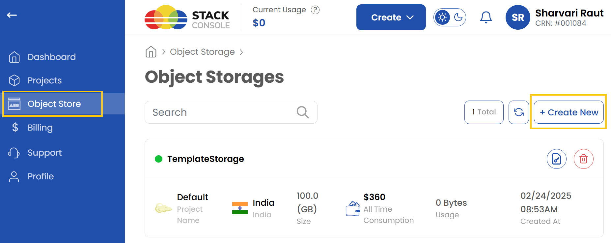
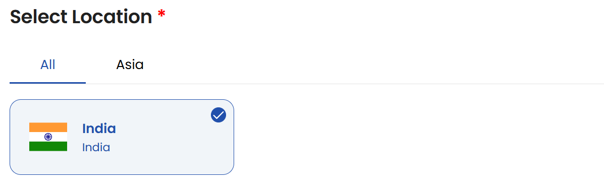
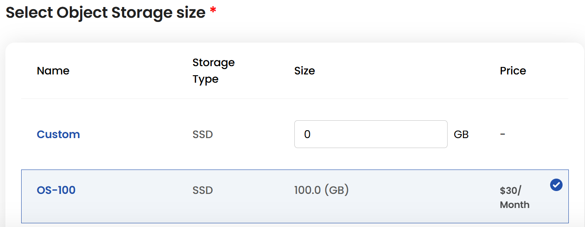
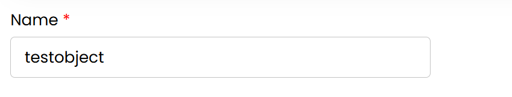

# Obyektli xotira yaratish

## Ceph obyektli xotirasi

**Ceph** — maʼlumotlarni saqlash va boshqarish uchun ishonchli va masshtablanuvchi obyektli xotira. **UzCloud** Ceph bilan oʻrnatilgan integratsiyani taqdim etadi, bu obyektli xotiralarni qulay yaratish va boshqarish imkonini beradi. Quyida UzCloud boshqaruv panelida **Ceph obyektli xotirasini** sozlash bosqichma-bosqich tushuntiriladi.

---

### Ceph obyektli xotirasini yaratish

- Chap menyuda **Object Storage** yorligʻini oching.
- Obyektli xotira yaratish uchun sahifaning oʻng tomonidagi **Create Object Storage** yoki **Create New** tugmasini bosing. Yaratish menyusi ochiladi.

### Loyihaga biriktirish

- Resurslarni qulay tartibga solish va boshqarish uchun obyektli xotirani loyihalaringizdan biriga biriktiring.

### Joylashuvni tanlash

- Xotira jismoniy joylashadigan maʼlumotlar markazini tanlang.
- Mavjud joylashuvlardan birini tanlang.

### Obyektli xotira hajmi

- Xotira turi va hajmiga boʻlgan talablaringizga qarab reja tanlang. Kerak boʻlsa, oʻzingizning rejangizni yaratishingiz mumkin.
- Narx tanlangan resurslarga bogʻliq boʻladi.

### Xotira nomi

- Xotirani boshqaruv panelida oson topish uchun noyob **Object Name** ni kiriting.

### Xotirani yaratish

- Kerakli **Billing Cycle** ni tanlang. Ceph Object uchun quyidagi davrlar qoʻllab-quvvatlanadi: soatlik, oylik, choraklik, yarim yillik, yillik, ikki yillik va uch yillik.
- Qoʻllab-quvvatlanadigan billing qoidalari: Date to Date, Fixed Calendar Month, Unfixed Calendar Month, Fixed Prorata va Unfixed Prorata.
- Bir nechta konfiguratsiya variantlari mavjud. Xizmat turli cloud-native stsenariylar uchun moslashuvchan va masshtablanuvchi obyektli xotirani taqdim etadi.
- Barcha parametrlarni va umumiy narxni tekshiring. Xotirani yaratish uchun **Review and Create** tugmasini bosing.

### Xulosa

Ushbu qoʻllanmaga amal qilib, siz UzCloud’da **Ceph obyektli xotirasini** osongina sozlashingiz va boshqarishingiz mumkin. Bu maʼlumotlarni samarali saqlash uchun masshtablanuvchi va ishonchli yechim. Yordam kerak boʻlsa, UzCloud hujjatlarini oʻrganing yoki qoʻllab-quvvatlash xizmatiga murojaat qiling.
