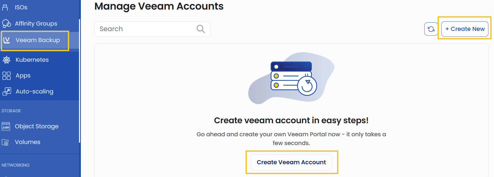
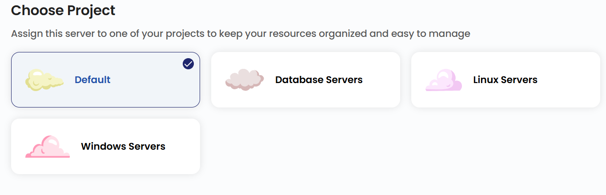
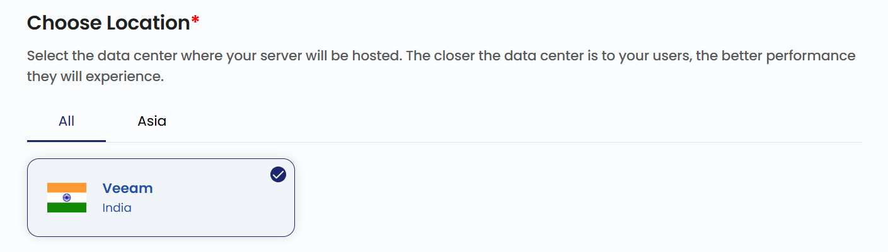
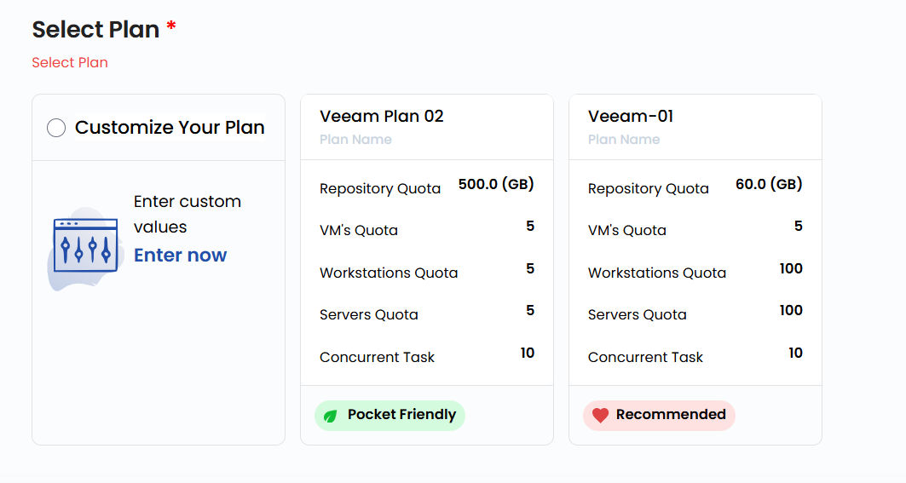
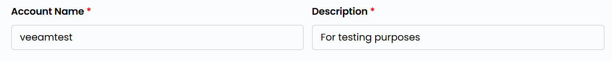

# Veeam Backup

## Veeam Backup

**Veeam Backup** — virtual, jismoniy va bulutli ish yuklamalarini himoya qiluvchi zaxiralash va tiklashning kompleks yechimi. UzCloud’da Veeam Backup maʼlumotlar mavjudligini, avariyadan keyin tiklashni va bulutli resurslarning zaxira nusxalarini qulay boshqarishni taʼminlaydi. Ushbu qoʻllanmada Veeam Backup akkauntini yaratish va boshqarish bosqichma-bosqich tushuntiriladi.

---

### Veeam Backup yaratish

- Chap menyuda **Veeam Backup** yorligʻini oching.
- **Veeam Backup** sahifasi ochiladi.

- Veeam Backup yaratish uchun sahifaning oʻng tomonidagi **Create Veeam Account** yoki **Create New** tugmasini bosing.

### Loyihani tanlash

- Resurslarni qulay tartibga solish va boshqarish uchun Veeam Backup serverini loyihalaringizdan biriga biriktiring.

### Joylashuvni tanlash

- Veeam Backup serveri jismoniy joylashadigan maʼlumotlar markazini tanlang.
- Mavjud joylashuvlardan birini tanlang.

### Rejani tanlash

- Rejani tanlang yoki talablaringizga muvofiq oʻzingizning rejangizni yarating.

- **Repository Quota** — zaxira nusxalar uchun xotiraning umumiy hajmini cheklaydi.
- **VM's Quota** — zaxiralanishi mumkin boʻlgan virtual mashinalar sonini cheklaydi.
- **Workstations Quota** — zaxiralanadigan ishchi stansiyalarning maksimal soni.
- **Servers Quota** — zaxiralanadigan jismoniy serverlar sonini cheklaydi.
- **Concurrent Task** — bir vaqtda bajariladigan zaxiralash yoki tiklash vazifalari soni.

### Veeam Backup nomi

- Veeam akkauntini boshqaruv panelida oson topish uchun noyob **Name** va tushunarli **Description** ni kiriting.

### Tekshirish va joylashtirish

- Kerakli **Billing Cycle** ni tanlang. Veeam Backup uchun quyidagi davrlar qoʻllab-quvvatlanadi: soatlik, oylik, choraklik, yarim yillik, yillik, ikki yillik va uch yillik.
- Qoʻllab-quvvatlanadigan billing qoidalari: Date to Date, Fixed Calendar Month, Unfixed Calendar Month, Fixed Prorata va Unfixed Prorata.
- SSD hajmi va maʼlumotlar markazi joylashuviga qarab turli paketlar mavjud — bu turli hududlar va xotira darajalari uchun zaxiralash strategiyasini tuzishda moslashuvchanlik beradi.
- Barcha parametrlarni va umumiy narxni tekshiring. Veeam akkauntini yaratish uchun **Review And Create Veeam Account** tugmasini bosing.

### Xulosa

Ushbu qoʻllanmaga amal qilib, siz UzCloud’da Veeam Backup akkauntini osongina yaratishingiz va boshqarishingiz mumkin. Veeam Backup maʼlumotlarni himoya qilish, avariyadan keyin tiklash va bulutli resurslarning zaxira nusxalarini qulay boshqarishni taʼminlaydi. Yordam kerak boʻlsa, UzCloud hujjatlarini oʻrganing yoki qoʻllab-quvvatlash xizmatiga murojaat qiling.

> [!TIP]
> **Shuningdek qarang:**
>
> - **[Veeam Backup’ni boshqarish](manage-veeam-backup.md)**
> - **[Avtomatik masshtablash](../auto-scaling/create-auto-scaling.md)**
> - **[Affinity guruhlari](../affinity-groups/create-affinity-groups.md)**
